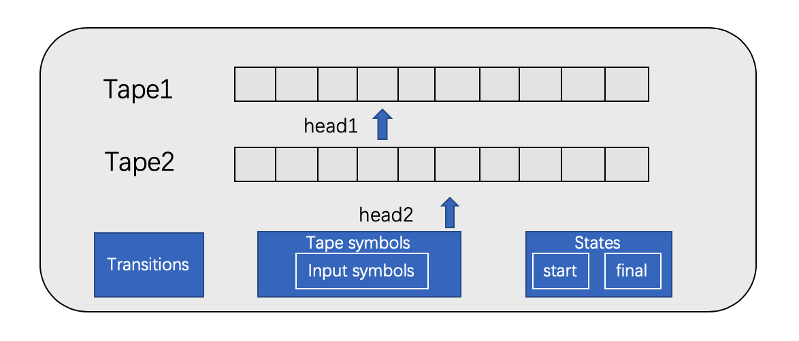
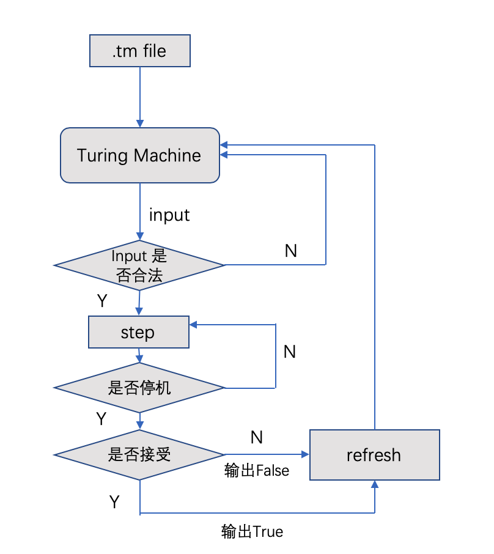
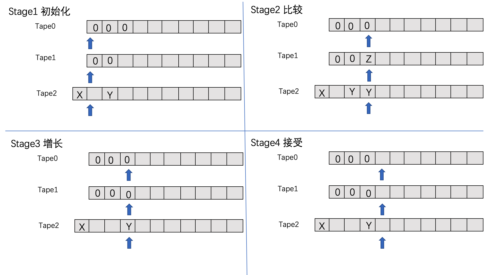
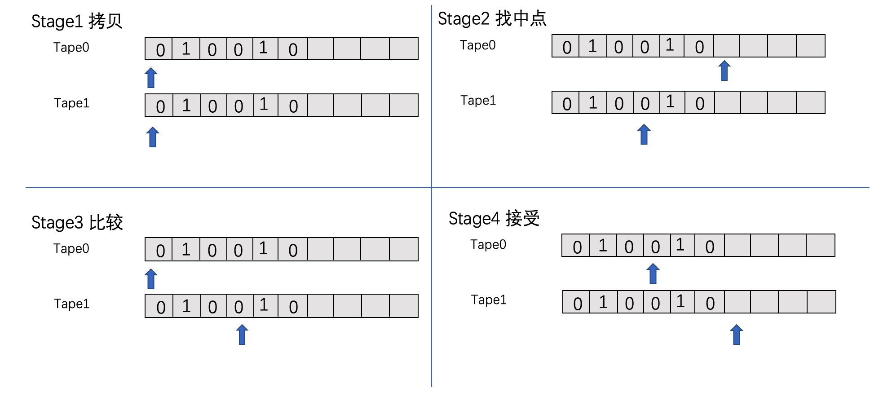
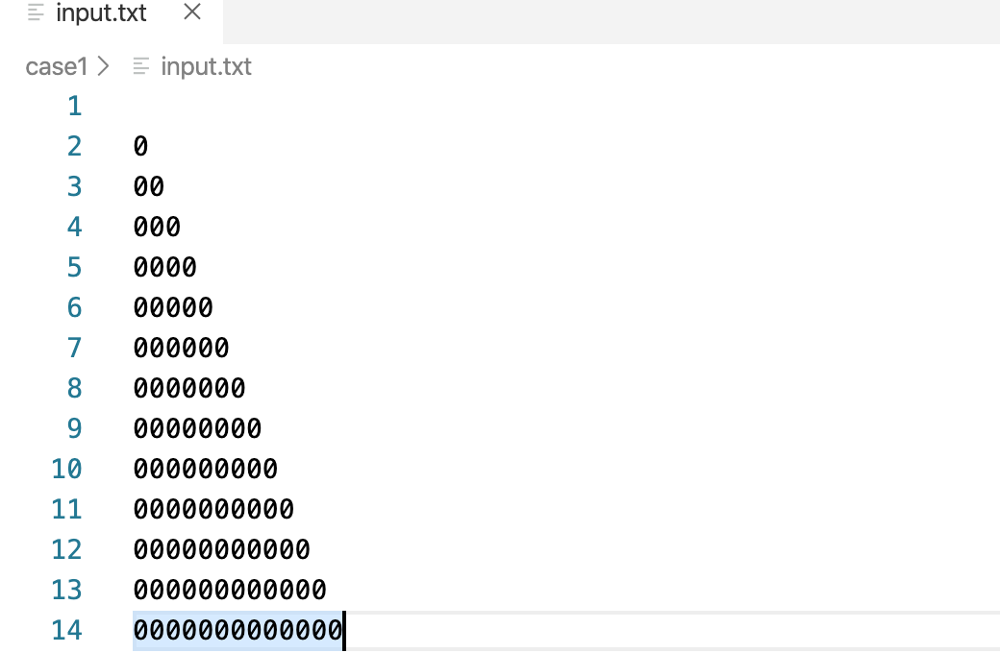
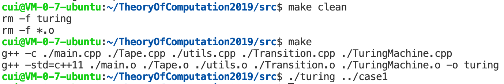
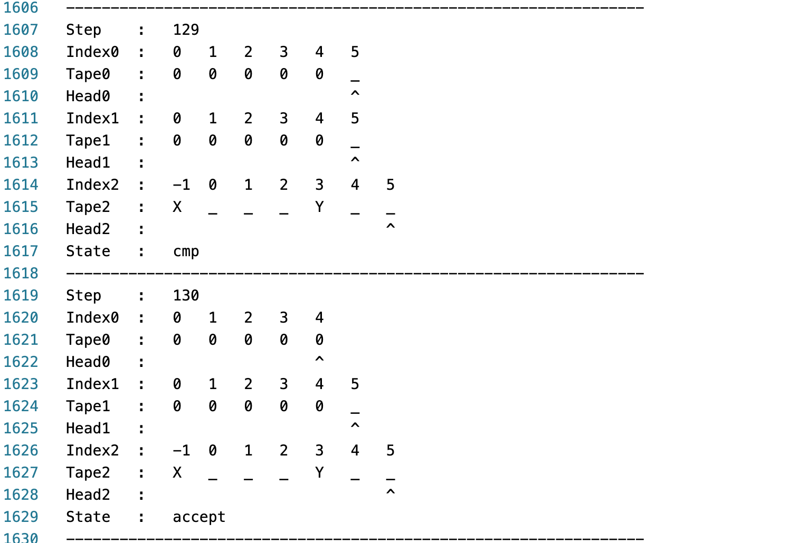

# 计算理论初步课程实验报告

姓名：崔子寒   学号：161220026

[TOC]

# 实验概述

<table>
  <tr>
    <th>项目</th>
  	<th>内容</th>
  </tr>
  <tr>
    <td width="100px">完成情况</td>
    <td> <ul>
      <li>使用C++编写了多纸带图灵机程序解析器，可以根据给定的.tm图灵机描述文件，生成一个与之对应的图灵机模拟器。并且可以读如输入文件input.txt的内容，将运行过程和运行结果输出至文件中。</li><li>实现了判定语言{0^k | k是斐波那契数}和{ww | w是01串}的多纸带图灵机，并编写了测试用例进行测试。</li> <li>项目使用Makefile构建，使用git进行管理。</li>
      </ul></td>
  </tr>
  <tr>
    <td>操作系统</td>
    <td>Ubuntu 18.04.1 LTS 64bit</td>
  </tr>
  <tr>
    <td>编译器</td>
    <td>g++ (Ubuntu 5.5.0-12ubuntu1) 5.5.0 20171010</td>
  </tr>
  <tr>
    <td>提交说明</td>
    <td>按照实验说明给定的方式设定提交文件的结构，my-project文件夹下是完整的代码。有可能因为环境更改导致turing缺少执行权限，请重新make生成可执行文件。
    </td>
  </tr></table>

## 编译运行说明

### 编译运行

项目使用**Makefile**进行构建。编译过程比较简单。执行<code>make</code>后，会生成可执行文件<code>turing</code>,通过运行<code>./turing path/to/case</code>进行测试。程序将读入**case**目录下的**test.tm**和**input.txt**，并在同一目录下生成**console.txt**和**result.txt**。

例子:

``` shell
user: ~/my-project/$ make
g++ -c ./main.cpp ./Tape.cpp ./utils.cpp ./Transition.cpp ./TuringMachine.cpp 
g++ -std=c++11 ./main.o ./Tape.o ./utils.o ./Transition.o ./TuringMachine.o -o turing
user: ~/my-project/$ ./turing ../case1

```

### Make选项

Makefile也提供了其他的Makefile目标，可以通过执行<code>make case1</code>或<code>make case2</code>自动编译生成可执行文件，并进行测试。（要求：case1和case2应该位于Makefile的上一层目录）

##设计思路

### 模块设计

一个多纸带的图灵机的结构如下图所示：


  

从面向对象的角度，一个图灵机对象由若干个**Tape**对象，若干个**Transition**对象，以及标定磁头位置的**head**变量，状态集**states**和符号集构成。其中，磁头、状态以及符号都可以用C++的已有类型表示，因此我们需要将**Tape**和**Transition**抽象成类。

在项目中，我设计了三个类，它们的基本信息描述如下：

<table>
  <tr>
    <th width="70px">类名</th>
    <th width="50px">包含文件</th>
    <th>功能描述</th>
  </tr>
  <tr>
    <td>TuringMachine</td>
    <td>TuringMachine.h TuringMachine.cpp</td>
    <td>图灵机模拟器类，可以读入一个图灵机配置文件，生成图灵机模拟器。</td>
  </tr>
  <tr>
    <td>Tape</td>
    <td>Tape.h Tape.cpp</td>
    <td>图灵机纸带类，模拟无限长的纸带，提供读写函数。</td>
  </tr>
  <tr>
    <td>Transition</td>
    <td>Transition.h Transition.cpp</td>
    <td>转移函数类，接受状态和当前纸带符号，给出新状态，新符号，以及磁头移动方向。</td>
  </tr>
</table>

这三个类的成员变量和成员函数的具体描述如下：

+ Tape

  <table>
    <tr>
      <td rowspan="4" width="60px">成员变量</td>
      <td><code>vector &ltchar&gt content </code>: 记录初始状态下，磁头右侧的内容，下标0对应纸带的第0块，依次递增</td>
    </tr>
    <tr>
      <td> <code>vector &ltchar&gt leftContent </code>: 记录初始状态下，磁头左侧的内容，下标0对应纸带上的-1，依次递减</td>
    </tr>
    <tr>
      <td><code>char blank </code>: 纸带上的空白符号定义</td>
    </tr>
    <tr>
      <td><code>int index </code>: 纸带的编号</td>
    </tr>
    <tr>
      <td rowspan="7">成员函数</td>
      <td><code>void init(string input) </code>: 初始化纸带内容，将input填入content中</td>
    </tr>
    <tr>
      <td> <code>char get(int index) </code>: 读取纸带第index块的内容，如果index超出当前已记录的内容范围，返回blank</td>
    </tr>
    <tr>
      <td> <code> void set(int index, char symbol)</code> : 设置纸带第index块的内容</td>
    </tr>
    <tr>
      <td> <code>void setBlank(char ch) </code>：设置代表空白的字符 </td>
    </tr>
    <tr>
      <td> <code>void setIndex(int index)</code> ：设置纸带的编号</td>
    </tr>
    <tr>
      <td> <code>string result()</code> : 返回纸带第一个非空符号到最后一个非空符号之间的内容</td>
    </tr>
  </table>

+ Transition

  <table>
    <tr>
      <td rowspan="5" width="60px">成员变量</td>
      <td><code>string state</code> : 输入状态</td>
    </tr>
    <tr>
      <td> <code>string tapeSymbols</code> : 当前纸带符号
      </td>
    </tr>
    <tr>
      <td> <code>string newSymbols</code> : 改写后的符号
      </td>
    </tr>
    <tr>
      <td> <code>string directions</code> : 磁头移动方向
      </td>
    </tr>
    <tr>
      <td> <code>string newState</code> : 转移后的状态
      </td>
    </tr>
    <tr>
      <td rowspan="6">成员函数</td>
      <td>
        <code>Transition(string description)</code> : 构造函数，接受.tm文件中转移函数的一个描述，设置转移函数变量，返回值等
      </td>
    </tr>
    <tr>
      <td> <code>bool match(string state, string tapeSymbols)</code> : 接受当前状态和当前纸带符号，判断是否匹配
      </td>
    </tr>
    <tr>
      <td> <code>string getNewSymbols()</code> : 返回改写后的符号
      </td>
    </tr>
    <tr>
      <td> <code>string getNewState()</code> : 返回转移后的状态
      </td>
    </tr>
    <tr>
      <td> <code>string getDirections()</code> : 返回磁头的移动方向</td>
    </tr>
  </table>


+ TuringMachine

  <table>
    <tr>
      <td width="60px" rowspan="12">成员变量 </td>
      <td> <code> int numOfTapes</code> : 纸带数目
      </td>
    </tr>
    <tr>
      <td> <code>int stepCount </code> : 当前步数
      </td>
    </tr>
    <tr>
      <td> <code>char blank </code> : 空白符号
      </td>
    </tr>
    <tr>
      <td> <code>string startState </code> : 开始状态
      </td>
    </tr>
    <tr>
      <td> <code>string currentState </code> : 当前状态
      </td>
    </tr>
    <tr>
      <td> <code>vector&ltstring&gt states </code> : 所有状态
      </td>
    </tr>
    <tr>
      <td> <code>vector&ltstring&gt finalStates </code> : 接受状态
      </td>
    </tr>
    <tr>
      <td> <code>vector&ltchar&gt inputSymbols </code> : 输入符号
      </td>
    </tr>
    <tr>
      <td> <code>vector&ltchar&gt tapeSymbols </code> : 纸带符号
      </td>
    </tr>
    <tr>
      <td> <code>vector&ltTransition&gt transitions </code> : 转移函数
      </td>
    </tr>
    <tr>
      <td> <code>vector&ltTape&gt tapes </code> : 纸带
      </td>
    </tr>
    <tr>
      <td> <code>vector&ltint&gt heads </code> : 磁头
      </td>
    </tr>
    <tr>
      <td rowspan="8"> 成员函数 </td>
      <td> <code>TuringMachine(string tmConfig) </code> : 构造函数，参数是.tm文件的路径。构造函数解析.tm文件，设置图灵机模拟器的各个成员变量。
      </td>
    </tr>
    <tr>
      <td> <code>bool input(string str) </code> : 读取输入的字符串
      </td>
    </tr>
    <tr>
      <td> <code>bool step() </code> : 图灵机执行一步，如果返回true，表明尚未停机，如果返回false，表明已经停机
      </td>
    </tr>
    <tr>
      <td> <code>string getID() </code> : 返回图灵机的一个Instantaneous Description
      </td>
    </tr>
    <tr>
      <td> <code>string toString() </code> : 返回图灵机的完整描述
      </td>
    </tr>
    <tr>
      <td> <code>void refresh() </code> : 重置图灵机模拟器，准备接受下一个输入
      </td>
    </tr> <tr>
      <td> <code>bool accept() </code> : 当前处于接受状态
      </td>
    </tr>
    <tr>
      <td> <code>string result() </code> : 返回第一条纸带上的内容
      </td>
    </tr>
  </table>

### 流程设计

在读取了图灵机配置文件后，我们的图灵机模拟器就可以按照文件描述的那样运行了。我们首先调用input函数，读取输入并判定输入的合法性；然后不断的执行step，直到停机。此时，再调用accept函数，判断是否接受，如果是，则输出True，否则输出False。再处理完一条输入后，可以调用refresh，准备接受下一个输入。

整个处理流程可以用下面的流程图描述：



对应的代码在**main.cpp**中，关键代码如下：

``` cpp
for (int i = 0; i < inputLines.size(); i++)
    {
        inputLine = inputLines[i];
        if (tm.input(inputLine))
        {   //输入合法
            do
            {
                writeConsoleLog << tm.getID();
            } while (tm.step());
            if(tm.accept()) {
                writeResult << "True" << endl;
            }
            else {
                writeResult << "False" << endl;
            }
        }
        else
        {
           //输入非法
           ...
        }
        tm.refresh();
    }
```


### 算法设计

#### 判定语言{0^k | k是一个斐波那契数}

+ 思路：斐波那契数的计算公式为：f(n) = f(n-1) + f(n-2) (n > 2), f(1)=f(2)=1。我们可以仿照斐波那契数的计算过程进行判断。首先我们需要3条纸带，Tape0储存输入的串，Tape1的串的长度按照斐波那契数进行增长，每增长一轮，就和Tape0进行比较，如果与Tape0长度相同，则接受；如果长度比Tape0短，则继续增长；如果长度比Tape0长，说明Tape0上的串的长度并不是一个斐波那契数，拒绝。Tape2用做标记，记录上一次Tape1的长度，也就是这一次要增长的长度。

+ 为了方便起见，我们首先判断输入串的长度是否为1，如果长度是1，直接接受，如果输入是空串，直接拒绝。当长度大于1时，我们在Tape1上写入长度为2的串，在Tape2上标记上一次Tape1的长度为1。然后开始“比较->增长”的不断重复，直到停机。

+ 算法示例：下图描述了图灵机接受“000”的过程

  

  有关上图的一些解释：

  1. 在初始化阶段，我们确定了输入串的长度大于1，所以Tape1中的串从“00”开始增长。Tape2中，我们在-1块上写入标记X，在第2块写入标记Y，规定X和Y之间的空格数就是Tape1中的串下次增长的长度。
  2. 在比较阶段，三个head同步右移，直到发现了Tape1中的串比Tape0中的串要短。此时，我们将这个位置在Tape1中标记为Z，认为这是下次比较开始的位置，在Tape2中更新Y。
  3. 增长阶段，我们把head2移到X标记处，然后head1和head2向右移动，开始增长，直到head2碰到第一个Y。然后head2清空这个Y，将head2移到下一个Y，将head1移到之前到Z，并将Z设置为0，然后开始下一次比较增长过程，如果比较时发现head0和head1同时指向了空，那么就接受。清空Tape0，并写入True。


#### 判定语言{ww | w in {0,1}*}

+ 思路：判定一个串是否由两个相同的串拼接而成，我们需要寻找这个串的中点，然后比较中点前和中点后的内容是否相同。如果搜索中点的过程中发现串的长度为奇数，那么直接拒绝。搜索中点可以采用类似于搜索链表中点的方法，用两个磁头，从头开始，一个每次走一步，一个每次走两步，当第二个走到尽头时，第一个就是中点。

+ 设计的图灵机拥有两条纸带，首先将输入从第一条纸带拷贝到第二条纸带；然后head0和head1开始右移，head1每右移一次，head0就右移2次，当head0指向空时停止；将head0移到输入最左端，然后比较head0和head1右侧的内容，直到head1指向空，接受，如果内容不相等，拒绝。

+ 算法示例，下图描述了接受“010010”的过程：

  

## 运行展示

这里以case1为例，展示图灵机模拟器的完整运行过程：

1. 首先，在case1下准备我们的输入文件input.txt:

   

2. 编译执行：

   

3. 查看结果(case1/result.txt)：

   

4. 查看运行过程(case1/console.txt)：

   

   

## 总结感想

经过这次实验，加深了对与图灵机运行过程的理解，也体会到了多纸带图灵机拥有更强的编程能力。将现实问题转换成用图灵机解决的问题需要巧妙的构思和设计。

另外，这次实验也锻炼了编程能力和动手能力。


